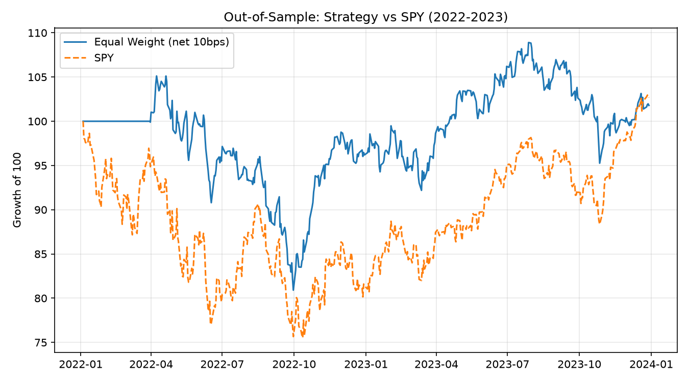
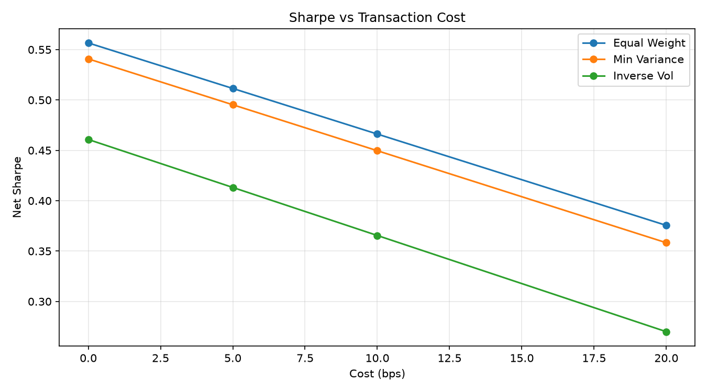

# Systematic Multi-Factor Portfolio (Research Prototype)

A modular backtesting research prototype for a U.S. large-cap long-only
cross-sectional strategy combining momentum and low-volatility signals.
It compares equal-weight, minimum-variance (constrained) and inverse-volatility
allocations against SPY, with **in-sample / out-of-sample validation** and
**transaction-cost sensitivity**.

## Method
- **Universe:** 30 U.S. large-cap stocks (+ SPY benchmark)
- **Period:** 2019-01 to 2023-12 (daily)
- **Signals:** momentum + low-volatility, cross-sectionally z-scored and combined
- **Allocation:** equal weight; long-only minimum variance (SLSQP, w>=0, sum=1);
  inverse-volatility weighting
- **Backtest:** weekly rebalancing, with transaction costs and turnover modelled
- **Validation:** scheme selected in-sample (2019-2021), then **frozen** and
  tested out-of-sample (2022-2023); cost sensitivity at 0 / 5 / 10 / 20 bps
- **Metrics:** CAGR, annualised vol, Sharpe (with risk-free rate), Sortino,
  max drawdown, Calmar, turnover

## Results

**In-sample (2019-2021, net of 10 bps)** — Equal Weight selected (highest Sharpe):

| Scheme        | CAGR % | Vol % | Sharpe | Sortino | MaxDD % | Calmar |
|---------------|--------|-------|--------|---------|---------|--------|
| Equal Weight  | 20.6   | 19.8  | 0.84   | 0.83    | -25.5   | 0.81   |
| Min Variance  | 20.0   | 19.7  | 0.82   | 0.80    | -25.5   | 0.78   |
| Inverse Vol   | 17.6   | 18.9  | 0.74   | 0.73    | -25.0   | 0.70   |

**Out-of-sample (2022-2023, frozen Equal Weight):**

| Metric | Strategy | SPY   |
|--------|----------|-------|
| CAGR % | 0.9      | 1.3   |
| Vol %  | 14.3     | 19.5  |
| Sharpe | -0.15    | -0.04 |
| MaxDD %| -23.0    | -24.5 |



**Cost sensitivity (2019-2023, net Sharpe):**

| Scheme        | 0 bps | 5 bps | 10 bps | 20 bps |
|---------------|-------|-------|--------|--------|
| Equal Weight  | 0.56  | 0.51  | 0.47   | 0.38   |
| Min Variance  | 0.54  | 0.50  | 0.45   | 0.36   |
| Inverse Vol   | 0.46  | 0.41  | 0.37   | 0.27   |



## Key Findings

**1. Strong in-sample performance did not persist out-of-sample.**
The equal-weight scheme had an in-sample Sharpe of 0.84 (2019-2021) but fell to
about **-0.15 out-of-sample** (2022-2023), roughly tracking a weak market with
no added value. This is a textbook case of in-sample overfitting / regime
dependence — and exactly why frozen out-of-sample testing matters.

**2. Transaction costs materially erode returns.**
Moving from 0 to 20 bps cut the equal-weight Sharpe by roughly a third
(0.56 → 0.38), so a signal's gross performance is meaningless without a cost model.

**3. Minimum-variance reduces risk, not risk-adjusted return.**
Constrained min-variance delivered the lowest volatility and drawdown but a
lower Sharpe than naive equal weighting — consistent with DeMiguel, Garlappi &
Uppal (2009): 1/N often beats optimised portfolios out of sample, due to
covariance estimation error.

## Important Limitations (read before interpreting)
- **Survivorship bias:** the universe is a fixed list of *current* large-cap
  survivors, not a point-in-time constituent list, which inflates historical
  performance. A true point-in-time / delisting-inclusive universe requires
  paid data (e.g. CRSP).
- Costs are a simple bps-on-turnover model (no explicit bid-ask spread / impact).
- This is a **research prototype**, not a deployable or validated trading strategy.

## Run
```bash
pip install yfinance pandas numpy scipy matplotlib
python main.py
