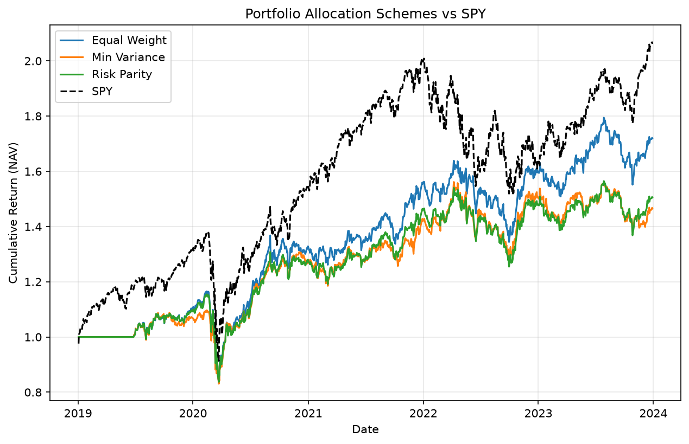
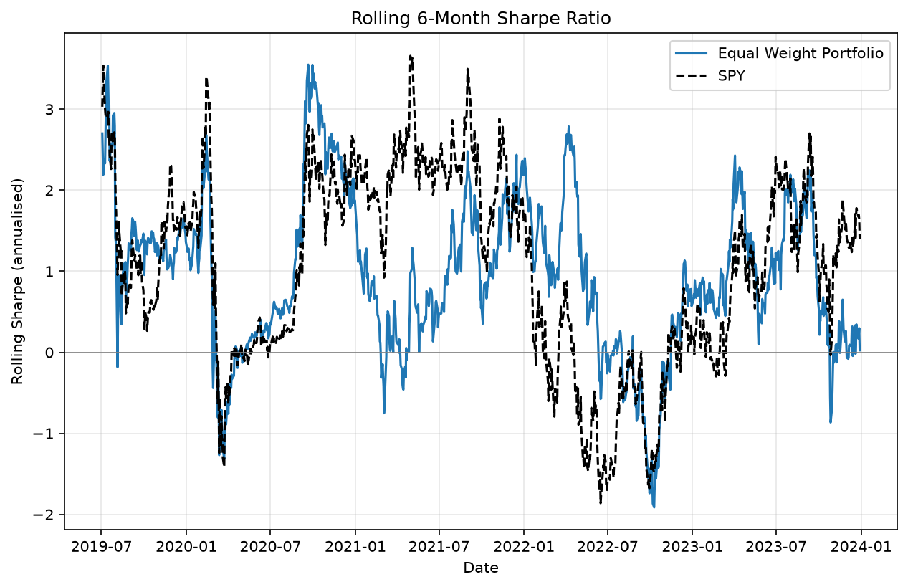
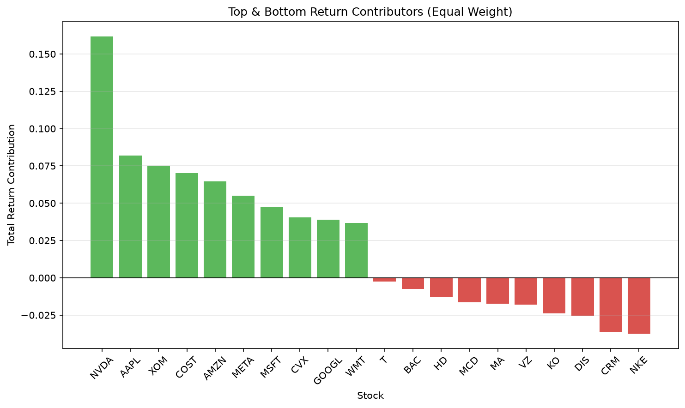

# Systematic Multi-Factor Portfolio

A systematic equity portfolio framework combining multiple alpha factors,
comparing allocation schemes against a benchmark, with rolling performance
and return-attribution analysis.

## Overview
- **Universe:** 30 US large-cap stocks (+ SPY benchmark)
- **Period:** 2019–2024 (daily)
- **Signal:** composite of momentum and low-volatility factors (cross-sectional z-score)
- **Allocation schemes:** equal weight, minimum variance, risk parity
- **Rebalancing:** weekly
- **Analysis:** Sharpe, drawdown, beta/alpha vs SPY, rolling Sharpe, attribution

## Results: Allocation Schemes vs SPY

| Metric        | Equal Weight | Min Variance | Risk Parity | SPY   |
|---------------|--------------|--------------|-------------|-------|
| Annual Return | 0.124        | 0.090        | 0.096       | 0.167 |
| Annual Vol    | 0.175        | 0.161        | 0.167       | 0.210 |
| Sharpe        | 0.708        | 0.556        | 0.576       | 0.796 |
| Max Drawdown  | -0.282       | -0.243       | -0.274      | -0.337|
| Beta vs SPY   | 0.685        | 0.583        | 0.645       | —     |
| Alpha vs SPY  | +0.009       | -0.008       | -0.012      | —     |



## Key Findings

**1. Minimum-variance reduces risk but not risk-adjusted return.**
Min-variance achieved the lowest volatility (16%), drawdown (-24%) and beta
(0.58), but a *lower* Sharpe than naive equal weighting (0.56 vs 0.71), and
only equal weight produced positive alpha. This replicates the DeMiguel,
Garlappi & Uppal (2009) result that 1/N diversification often beats optimised
portfolios out of sample, due to covariance estimation error.

**2. Performance is highly regime-dependent.**
The rolling 6-month Sharpe ranged from **-1.9 to +3.5**, showing that the
full-sample average hides large time-variation, including a deep negative
patch around the 2020 COVID drawdown.



**3. Returns are concentrated (limited effective diversification).**
Attribution shows NVDA alone contributed ~16% of total return, with the top
five names driving most of the performance — a concentration risk that a raw
count of holdings would miss.



## How to Run
```bash
pip install yfinance pandas numpy matplotlib
python main.py
